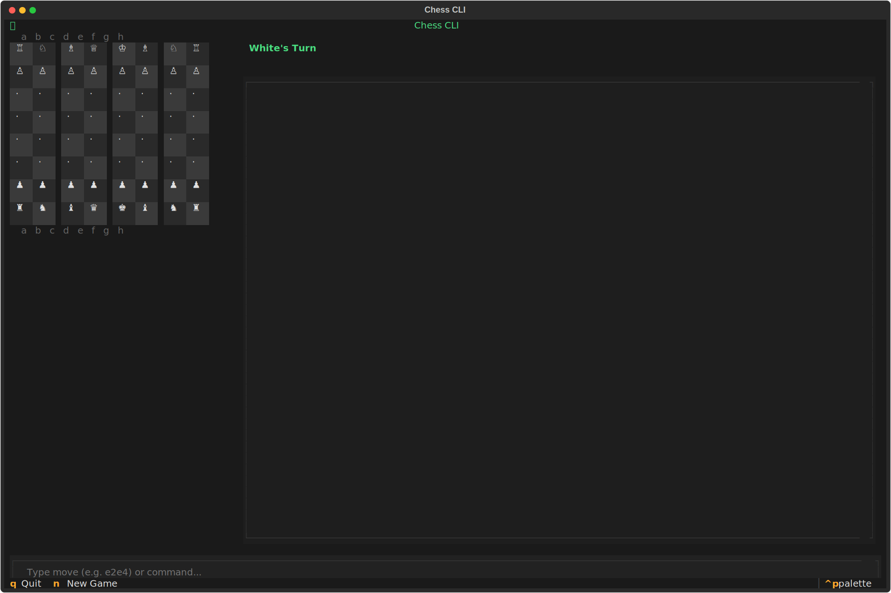

<p align="center">
  <h1 align="center">Chess CLI</h1>
  <p align="center">
    <strong>⚠️ This project is archived and no longer maintained.</strong>
    <br /><br />
    A terminal-based chess game with an AI opponent, built in Python using Textual.
    <br /><br />
    <a href="https://github.com/urmzd/chess-cli/releases">Install</a>
    &middot;
    <a href="https://github.com/urmzd/chess-cli/issues">Report Bug</a>
  </p>
</p>

<p align="center">
  <a href="https://github.com/urmzd/chess-cli/actions/workflows/ci.yml"></a>
</p>

<p align="center">
  
</p>

## Features

- Interactive TUI with click-to-move and keyboard input
- Legal move highlighting and last-move indicators
- AI opponent powered by minimax with alpha-beta pruning (configurable depth)
- Fully immutable game state using frozen Pydantic models
- Check, checkmate, stalemate, and 50-move draw detection
- Pawn promotion, castling, and en passant support
- Move log in standard paired notation

## Prerequisites

- Python 3.12+
- [uv](https://docs.astral.sh/uv/)
- [just](https://github.com/casey/just) (optional, for dev tasks)

## Quick Start

```bash
git clone https://github.com/urmzd/chess-cli.git
cd chess-cli
uv sync
```

## Running the Game

```bash
# Via entry point
uv run chess-cli

# Or as a module
uv run python -m chess_cli
```

## Gameplay

### Mouse

Click a piece to select it. Legal target squares are highlighted in green. Click a target square to move.

### Keyboard

Type commands into the input bar at the bottom of the screen:

| Command | Description |
|---------|-------------|
| `e2e4` | Move a piece (from-square to-square) |
| `a7a8q` | Move with pawn promotion (q/r/b/n) |
| `help` / `h` | Show available commands |
| `new` / `n` | Start a new game |
| `quit` / `q` | Exit the game |

### Keybindings

| Key | Action |
|-----|--------|
| `q` | Quit |
| `n` | New game |

## Architecture

The project is split into two packages under `src/`:

```
src/
├── chess_core/          # Pure game logic (no UI dependency)
│   ├── models/          # Frozen Pydantic models (Piece, Move, GameState, etc.)
│   ├── rules/           # Board ops, move generation, check/checkmate detection
│   └── engine/          # Static evaluation + minimax with alpha-beta pruning
└── chess_cli/           # Textual TUI application
    ├── app.py           # ChessApp entry point
    ├── app.tcss         # Terminal stylesheet
    ├── screens/         # GameScreen (main screen)
    └── widgets/         # ChessBoard, ChessSquare, CommandInput, MoveLog
```

`chess_core` is a standalone library with no Textual dependency. All game state is immutable -- every move produces a new `GameState` with no mutation.

## Development

```bash
# Install dev dependencies
uv sync --group dev

# Individual checks
just fmt          # check formatting (ruff)
just fmt-fix      # fix formatting
just lint         # check lints (ruff)
just lint-fix     # fix lints
just typecheck    # run mypy
just test         # run pytest

# Full CI check (fmt + lint + typecheck + test)
just ci

# Run the game
just run
```

### Pre-commit Hooks

The project uses [Conventional Commits](https://www.conventionalcommits.org/) enforced via a pre-commit hook. Install hooks with:

```bash
uv run pre-commit install --hook-type commit-msg
```

### CI/CD

- **CI** (`ci.yml`): Runs format, lint, typecheck, and test checks in parallel on PRs to `master`.
- **Release** (`release.yml`): On push to `master`, runs CI then builds and publishes a GitHub release via semantic-release.

## Agent Skill

This project ships an [Agent Skill](https://github.com/vercel-labs/skills) for use with Claude Code, Cursor, and other compatible agents.

**Install:**

```sh
npx skills add urmzd/chess-cli
```

Once installed, use `/chess-cli` to launch the game or work on the chess engine and TUI.

## License

[Apache-2.0](LICENSE)
